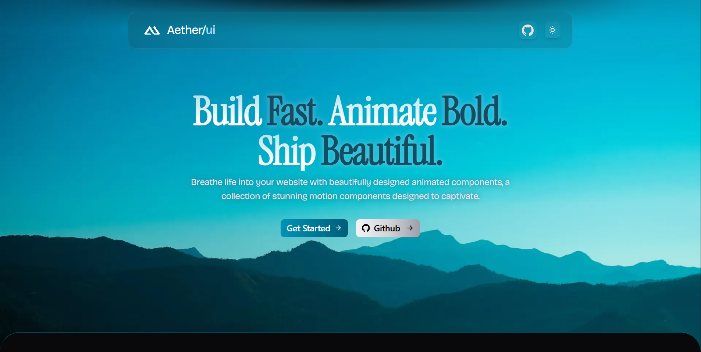

## 🔗 Links
- ## github repo
cli - https://github.com/Sallbro/backcraft-cli

repository - https://github.com/Sallbro/backcraft-repository

web - https://github.com/Sallbro/backcraft-web

- ## npm package
cli - https://www.npmjs.com/package/backcraft-cli

repository - https://www.npmjs.com/package/backcraft-registry

<h1 align="center">BackCraft</h1>

Breathe life into your backend with modular scaffolding. Backcraft CLI empowers developers with beautifully structured registry and plug-and-play components.
<h1 align="center">BackCraft</h1>

Breathe life into your website with beautifully designed animated components, a collection of stunning motion components designed to captivate.

## Documentation

Visit http://aetherui.in/docs to view the documentation.

## Contributing

Please read [CONTRIBUTING.md](/CONTRIBUTING.md).

## Big Thanks to

[Shadcn](https://github.com/shadcn-ui/ui)
[Ibelick (Motion-primitives)](https://github.com/ibelick/motion-primitives)

Learned a lot from these amazing libraries and there open source code.

## License

This project is licensed under the [MIT License](https://github.com/pantharshit007/aether-ui/blob/main/LICENCE).
